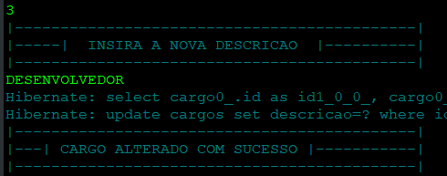

<!-- @import "[TOC]" {cmd="toc" depthFrom=1 depthTo=6 orderedList=false} -->

# :white_flower: EXERCICIOS JAVA SPRING BOOT :dark_sunglasses:

# FUNCIONABILIDADES.

Este projeto busca na base de dados informações sobre Funcionários, este estão atrelados a Unidades de Trabalhos e Cargos.

Conforme o diagrama abaixo.

##### TABELAS

### CRUD

O usuário pode executar os metodos CRUD para editar e alterar informações contidas no banco de dados, como UPDATE CREATE DELETE e FIND;
As ações poderão ser realizados pelo terminal.

CRUD

:white_check_mark: ADICIONAR:

:white_check_mark: BUSCAR:

:white_check_mark: DELETAR:

:white_check_mark: UPDATE:

##ESTRUTURA DO CÓDIGO. :gear: :gear:

Neste Código Foi utilizado práticas modernas do SPRING BOOT para conectar ao banco de dados,
O Spring Boot melhora o código tornando o mesmo mais legivel que o JPA e ajuda no desenvolvimento e conexão com o banco de dados
Desta forma foram criado 3 caminhos para conexão.
- [x] Class Funcionario
- [x] Class Unidade Trabalho
- [x] Class Cargos

Estas entidades possuem relaciomanetos com o banco de dados de OneToMany, ManyToMany, ManyToOny.

### :gear: Código para Funcionario :gear:

### :gear: Código para Unidade Trabalho :gear:

### :gear: Código para Cargos :gear:

##METODO REPOSITORY. :gear: :gear:

A interface Repository já aclopa no código com SPRING os metodos necessários para o CRUD.
O mesmo já faz o gerenciamento do JDBC e JPA buscando os dados e criando a conexão no banco.

Alguns metodos podem ser reescritos ou criados usando termos especificos do SPRING.

##METODO SERVICE. :gear: :gear:

O service realizará toda integração com o Repository e será responsável pelos retornos e configurações deseja para essa API.
O sitema utlizado é uma interação com o terminal sem usar interfaces ou html web para pegar os dados.

:white_check_mark: ESTRUTURA INICIAL:

:white_check_mark: 
<fieldset>
<legend>ADICIONAR</legend>
<small>Primeiro metodo do crud responsável por adicionar uma nova entidade ao banco de dados.</small>

</fieldset>

:white_check_mark:
<fieldset>
<legend>ALTERAR:</legend>
<small>Usando a ID da entidade informada no banco de dados, este metodo realiza a alteração dos dados realacionados ao ID</small>
<small>Mesmo que este metodo use recurso save ele não está salvando uma nova entidade, e sim alterando dados sobre ela</small>

</fieldset>

:white_check_mark: 
<fieldset>
<legend>REMOVER:</legend>
<small>Remove uma entidade do banco de dados</small>

 
</fieldset>

:white_check_mark: 
<fieldset>
<legend>BUSCAR:</legend>
<small>Retorna todas unidades no banco de dados que estão relacinadas a entidade</small>

 
</fieldset>

##SPRING 'DERIVED QUERY'

É possivel personalizar algumas busca como no exemplo abaixo,
Neste exemplo foi usado o metodo findByNome que recebe uma String e retorna os dados pelo nome do funcionário.
o metodo deve ser adicionado no REPOSITORY.

 

 

 
---

CRIADO COM :heart: POR KAI WANG!

