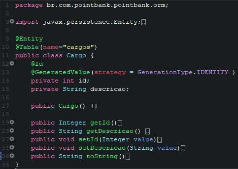

<!-- @import "[TOC]" {cmd="toc" depthFrom=1 depthTo=6 orderedList=false} -->

# :white_flower: EXERCICIOS JAVA SPRING BOOT :dark_sunglasses:

# FUNCIONABILIDADES.

Este projeto busca na base de dados informações sobre Funcionários, este estão atrelados a Unidades de Trabalhos e Cargos.

Conforme o diagrama abaixo.

##### TABELAS

### CRUD

O usuário pode executar os metodos CRUD para editar e alterar informações contidas no banco de dados, como UPDATE CREATE DELETE e FIND;
As ações poderão ser realizados pelo terminal.

CRUD

:white_check_mark: ADICIONAR:

:white_check_mark: BUSCAR:

:white_check_mark: DELETAR:

:white_check_mark: UPDATE:

##ESTRUTURA DO CÓDIGO. :gear: :gear:

Neste Código Foi utilizado práticas modernas do SPRING BOOT para conectar ao banco de dados,
O Spring Boot melhora o código tornando o mesmo mais legivel que o JPA e ajuda no desenvolvimento e conexão com o banco de dados
Desta forma foram criado 3 caminhos para conexão.
- [x] Class Funcionario
- [x] Class Unidade Trabalho
- [x] Class Cargos

Estas entidades possuem relaciomanetos com o banco de dados de OneToMany, ManyToMany, ManyToOny.

### :gear: Código para Funcionario :gear:

### :gear: Código para Unidade Trabalho :gear:

### :gear: Código para Cargos :gear:

##METODO REPOSITORY. :gear: :gear:

A interface Repository já aclopa no código com SPRING os metodos necessários para o CRUD.
O mesmo já faz o gerenciamento do JDBC e JPA buscando os dados e criando a conexão no banco.

Alguns metodos podem ser reescritos ou criados usando termos especificos do SPRING.

##METODO SERVICE. :gear: :gear:

O service realizará toda integração com o Repository e será responsável pelos retornos e configurações deseja para essa API.
O sitema utlizado é uma interação com o terminal sem usar interfaces ou html web para pegar os dados.

:white_check_mark: ESTRUTURA INICIAL:

:white_check_mark: 
<fieldset>
<legend>ADICIONAR</legend>
<small>Primeiro metodo do crud responsável por adicionar uma nova entidade ao banco de dados.</small>

</fieldset>

:white_check_mark:
<fieldset>
<legend>ALTERAR:</legend>
<small>Usando a ID da entidade informada no banco de dados, este metodo realiza a alteração dos dados realacionados ao ID</small>
<small>Mesmo que este metodo use recurso save ele não está salvando uma nova entidade, e sim alterando dados sobre ela</small>

</fieldset>

:white_check_mark: 
<fieldset>
<legend>REMOVER:</legend>
<small>Remove uma entidade do banco de dados</small>

 
</fieldset>

:white_check_mark: 
<fieldset>
<legend>BUSCAR:</legend>
<small>Retorna todas unidades no banco de dados que estão relacinadas a entidade</small>

 
</fieldset>

##SPRING DERIVED QUERY

É possivel personalizar algumas busca como no exemplo abaixo,
Neste exemplo foi usado o metodo findByNome que recebe uma String e retorna os dados pelo nome do funcionário.
o metodo deve ser adicionado no REPOSITORY.

Foi informado ao REPOSITORY que haverá uma nova busca com retorno de lista de funcionários, nesta busca será iserido uma STRING com o nome do funcionário.
O Spring identifica que a entidade funcionario tem um atributo chamado nome e que é do tipo String e etão automáticamente cria a Query para o banco de dados.

O metodo foi criado em relatório funcionário para retornar os dados escolhidos.

Após o processo o sistema retorna os funcionários associados aos nomes informados.

###USANDO JPQL

É possivel usar o JPQL para auxiliar na criação de novos metodos para buscar usuários.
conforme o exemplo logo abaixo.

###USANDO NATIVEQUERY

Além das Query do JPQL também foi utlizando os metodos com Query Nativas do SQL para buscar os valores desejados como no exemplo.
nesses caso na anotação QUERY foi usado propriedade VALUE e NATIVEQUERY como TRUE;

###USANDO PAGING AND SORTING

É possivel realizar uma pesquisa páginada por número de Entidades, para isso modificamos primeiro a interface CrudRepository por PagingAndSortingRepository,
Esta interface permite criar modelos de paginação.

Após modificar o REPOSITORY então em service adicionado o PAGEABLE e informado o PageRequest onde informamos a página da consulta, a quantidade de consulta retornadas e a ordenação da consulta.

Como retorno temos.

###USANDO PROJECTION

Projectos são facilidades disponibilizada no SPRING que permite determinar quais atributos devem retornar de uma entidade, 
para criar uma projection é simples.
1. Criar pasta projection - dentro de projection criar uma interface com as informações de retorno. OBS: os retornos devem ser o mesmo da Entidade.

2. Criar em REPOSITORY informações para o retorno com Native Query que deve retornar as colunas desejadas da pesquisa.

3. Criar SERVICE e  o metodo que retorna a PROJECTION criada com os valores get informados.

### USANDO SPECIFICATION

Quando queremos executar querys especificas para determinados retornos de entidades como o LIKE ou GREATERTHAN etc. podemos usar o SPECIFICATION do SPRING.

1. Importamos o JpaSpecificationExecutor<clss> e incluimos como extensão interface em nosso REPOSITORY.

2.Criamos um novo arquivo na pasta SPECIFICATION e então criamos o metodo do SPECIFICATION e seu retorno.

3.Depois adicionado o metodo em findAll na pesquisa conforme o print.

####OUTROS METODOS SPECIFICATION

GreateThan like Equal

---

CRIADO COM :heart: POR KAI WANG!

